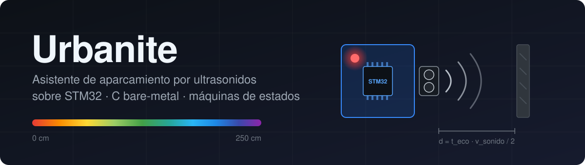
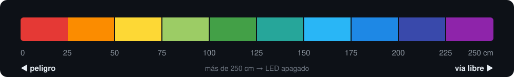
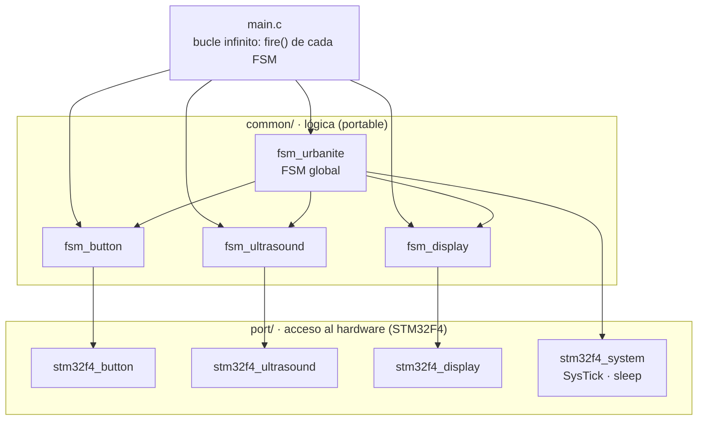
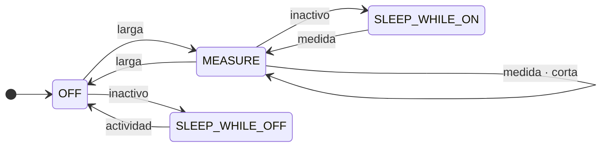
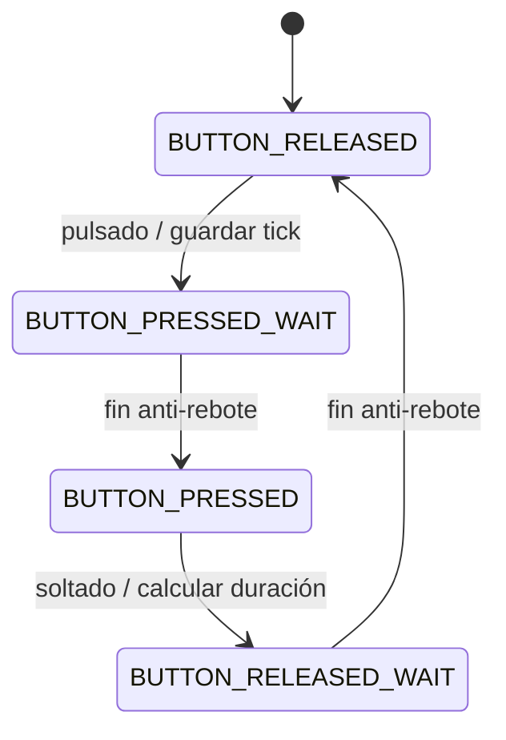
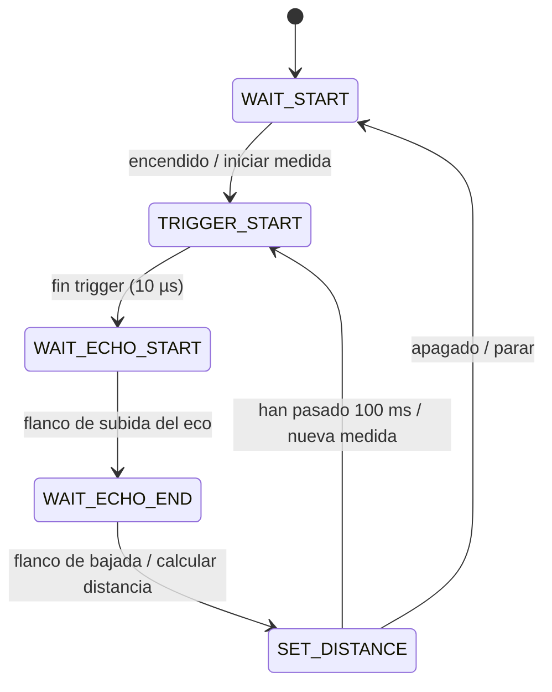
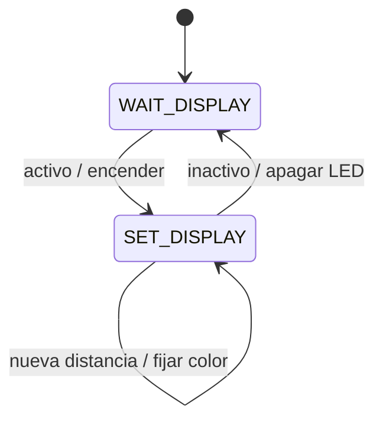
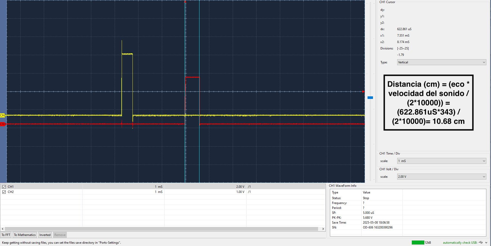

<p align="center">
  
</p>

<p align="center">
  
  
  
  
  
</p>

<p align="center">
  <b>Sistema de asistencia al aparcamiento</b> que mide la distancia a un obstáculo con un sensor de ultrasonidos
  <b>HC-SR04</b> y la representa en tiempo real con el color de un <b>LED RGB</b>.<br>
  Programado en C a nivel de registro sobre una <b>Nucleo-STM32F446RE</b>, con arquitectura de <b>máquinas de estados finitos</b>,
  interrupciones, temporizadores en <i>input capture</i> y PWM, y modos de <b>bajo consumo</b>.
</p>

---

## Índice

- [Cómo funciona](#cómo-funciona)
- [Escala de colores](#escala-de-colores)
- [Hardware y conexionado](#hardware-y-conexionado)
- [Arquitectura del software](#arquitectura-del-software)
- [Máquinas de estados](#máquinas-de-estados)
- [Medida de la distancia](#medida-de-la-distancia)
- [Desarrollo por versiones](#desarrollo-por-versiones)
- [Estructura del repositorio](#estructura-del-repositorio)
- [Compilar y cargar en la placa](#compilar-y-cargar-en-la-placa)
- [Tests](#tests)
- [Autores](#autores)

---

## Cómo funciona

| Acción | Resultado |
|---|---|
| **Pulsación larga** del botón de usuario (> 1 s) | Enciende / apaga el sistema |
| **Pulsación corta** (entre 0,5 s y 1 s) | Pausa / reanuda el display |
| Obstáculo delante del sensor | El LED cambia de color según la distancia (de rojo a morado) |
| Display en pausa y obstáculo **muy cerca** (< 12 cm) | El LED se vuelve a encender igualmente como aviso de seguridad |
| Sin actividad | El microcontrolador entra en modo *sleep* (`WFI`) y se despierta con la siguiente interrupción |

El sensor lanza una medida cada **100 ms**. Cada distancia que se muestra es la **mediana de 5 medidas**, lo que filtra los ecos espurios y evita que el color parpadee.

Por el puerto serie se registra lo que va pasando (ejemplo de salida):

```text
[URBANITE][1520] Urbanite system ON
[URBANITE][1690] Distance: 87 cm
[URBANITE][1790] Distance: 64 cm
[URBANITE][2310] Urbanite system display PAUSE
```

## Escala de colores

<p align="center">
  
</p>

| Distancia | Color | PWM (R, G, B) |
|---|---|---|
| 0 – 25 cm | 🔴 Rojo | (255, 0, 0) |
| 25 – 50 cm | 🟠 Naranja | (255, 7, 0) |
| 50 – 75 cm | 🟡 Amarillo | (255, 12, 0) |
| 75 – 100 cm | Verde claro | (128, 94, 0) |
| 100 – 125 cm | 🟢 Verde | (0, 255, 0) |
| 125 – 150 cm | Verde azulado | (0, 255, 128) |
| 150 – 175 cm | Azul claro | (0, 255, 255) |
| 175 – 200 cm | 🔵 Azul | (0, 128, 255) |
| 200 – 225 cm | Azul oscuro | (0, 0, 255) |
| 225 – 250 cm | 🟣 Morado | (128, 0, 255) |
| > 250 cm | ⚫ Apagado | (0, 0, 0) |

> La columna PWM es el nivel (0–255) que se escribe en cada canal del LED; por eso algunos tonos no coinciden con su código RGB de pantalla.

## Hardware y conexionado

| Componente | Señal | Pin | Periférico |
|---|---|---|---|
| Botón de usuario (placa) | Entrada | `PC13` | EXTI 15-10, anti-rebote por software (200 ms) |
| HC-SR04 | Trigger | `PB0` | GPIO + `TIM3` (pulso de 10 µs) |
| HC-SR04 | Echo | `PA1` | `TIM2` CH2 en *input capture*, ambos flancos, 1 MHz |
| — | Cadencia de medidas | — | `TIM5` (100 ms) |
| LED RGB | Rojo | `PB6` | `TIM4` CH1 (PWM) |
| LED RGB | Verde | `PB8` | `TIM4` CH3 (PWM) |
| LED RGB | Azul | `PB9` | `TIM4` CH4 (PWM) |

## Arquitectura del software

El código está dividido en dos capas:

- **`common/`**: lógica de la aplicación, independiente del hardware. Son las máquinas de estados.
- **`port/`**: capa de portabilidad (HAL propia) que accede a los registros del STM32F4: GPIO, EXTI, timers, NVIC y bajo consumo.

Así, las FSM nunca tocan un registro directamente, y llevar el sistema a otro microcontrolador solo requiere reescribir `port/`.



## Máquinas de estados

Todas las FSM se implementan con tablas de transiciones `{estado_origen, condición, estado_destino, acción}` que se evalúan en cada vuelta del bucle principal.

<details open>
<summary><b>FSM global · <code>fsm_urbanite</code></b></summary>



| Evento | Significado | Acción |
|---|---|---|
| `larga` | Pulsación > 1 s | Encender (arranca sensor y display) o apagar |
| `corta` | Pulsación de 0,5 a 1 s | Pausar / reanudar el display |
| `medida` | Hay una distancia nueva | Actualizar el color del LED |
| `inactivo` | Ninguna FSM tiene trabajo pendiente | Entrar en *sleep* (`WFI`); se repite mientras siga inactivo |
| `actividad` | Una interrupción despierta al sistema | Volver al estado activo |

</details>

<details>
<summary><b>Botón con anti-rebote · <code>fsm_button</code></b></summary>



</details>

<details>
<summary><b>Sensor de ultrasonidos · <code>fsm_ultrasound</code></b></summary>



</details>

<details>
<summary><b>LED RGB · <code>fsm_display</code></b></summary>



</details>

## Medida de la distancia

El HC-SR04 devuelve un pulso cuya duración es el tiempo de ida y vuelta del ultrasonido. `TIM2` captura los dos flancos del eco a 1 MHz (1 tick = 1 µs) y la distancia se calcula como:

$$
d\,[\text{cm}] = \frac{t_{\text{eco}}\,[\mu s] \cdot 343\,[\text{m/s}]}{2 \cdot 10\,000}
$$

Las 5 últimas medidas se ordenan con `qsort` y se toma la **mediana** como valor final.

Captura real del osciloscopio durante las pruebas: en amarillo el trigger y en rojo el eco. Un eco de **622,9 µs** corresponde a **10,68 cm**.

<p align="center">
  
</p>

## Desarrollo por versiones

El proyecto se construyó de forma incremental, cada versión con sus tests unitarios y su documentación:

| Versión | Contenido |
|---|---|
| **V1** | FSM del botón con interrupción externa, anti-rebote y medida de la duración de la pulsación con SysTick |
| **V2** | Subsistema de ultrasonidos: trigger por interrupción de timer, captura del eco por *input capture* y mediana de medidas |
| **V3** | Subsistema de visualización: LED RGB con PWM sobre `TIM4` |
| **V4** | FSM global del sistema e integración de los modos de bajo consumo |
| **V5** | Mejoras propias: escala de color ampliada a 10 niveles para una indicación más fina de la distancia |

## Estructura del repositorio

```text
urbanite/
├── main.c                    # Punto de entrada: crea las FSM y las ejecuta en bucle
├── common/                   # Lógica independiente del hardware
│   ├── include/              #   fsm_button.h · fsm_ultrasound.h · fsm_display.h · fsm_urbanite.h
│   └── src/                  #   Implementación de las cuatro FSM
├── port/                     # Capa de acceso al hardware
│   ├── include/              #   Interfaz port_*.h (común a cualquier plataforma)
│   └── stm32f4/              #   Implementación para STM32F4 (GPIO, EXTI, timers, PWM, sleep, ISR)
├── example/                  # Programas de ejemplo de las versiones V1, V2 y V3
├── test/                     # Tests unitarios (Unity) de las FSM y de los drivers
├── docs/                     # Imágenes y estilo para la documentación Doxygen
├── Doxyfile                  # Configuración de Doxygen
└── CMakeLists.txt
```

## Compilar y cargar en la placa

El proyecto se compila dentro del entorno **[MatrixMCU](https://github.com/sdg2DieUpm/MatrixMCU)**, que aporta los drivers CMSIS del STM32F4, la librería de FSM, Unity, el *linker script* y la configuración de OpenOCD.

**Requisitos:** `arm-none-eabi-gcc`, `cmake`, `make` y `openocd`.

```bash
# 1. Clonar el entorno y meter este proyecto dentro de projects/
git clone https://github.com/sdg2DieUpm/MatrixMCU.git
cd MatrixMCU/projects
git clone https://github.com/gonzaloleis/urbanite.git
cd urbanite

# 2. Configurar y compilar para la Nucleo-F446RE
cmake -S . -B build -DPLATFORM=stm32f446re -DCMAKE_BUILD_TYPE=Debug
cmake --build build

# 3. Cargar el firmware en la placa (por USB, ST-LINK)
cmake --build build --target flash-main
```

Los binarios se generan en `bin/stm32f446re/Debug/`. Si MatrixMCU está en otra ruta, se indica con `-DMATRIXMCU=<ruta>`.

**Documentación del código:** todas las funciones están documentadas con Doxygen.

```bash
doxygen Doxyfile   # genera docs/html/index.html
```

## Tests

Los tests usan **Unity** y se ejecutan directamente en la placa. Cada uno tiene su propio objetivo `flash-<test>`.

| Test | Qué comprueba |
|---|---|
| `test_fsm_button` | Transiciones y anti-rebote de la FSM del botón |
| `test_fsm_ultrasound` | Ciclo completo de medida y cálculo de distancia |
| `test_fsm_display` | Selección de color y encendido/apagado del LED |
| `test_port_button` | Configuración de GPIO y EXTI del botón |
| `test_port_ultrasound_timer_trigger` | Timer del pulso de trigger |
| `test_port_ultrasound_timer_echo` | *Input capture* del eco |
| `test_port_ultrasound_timer_measurements` | Timer de cadencia entre medidas |
| `test_port_display` | Configuración de `TIM4` y de los canales PWM |

```bash
cmake --build build --target flash-test_fsm_ultrasound
```

## Autores

Proyecto desarrollado para la asignatura **Sistemas Digitales II** (ETSI de Telecomunicación, Universidad Politécnica de Madrid), curso 2024-25.

- **Gonzalo Leis Varela** · [@gonzaloleis](https://github.com/gonzaloleis)
- **Nicolás Hernández Martín** · [@nicoheernandez](https://github.com/nicoheernandez)

La estructura base del proyecto, el entorno MatrixMCU y los tests de partida los proporciona el Departamento de Ingeniería Electrónica de la UPM.

## Licencia

Distribuido bajo licencia **GNU GPL v3.0**. Consulta [`LICENSE`](LICENSE).
